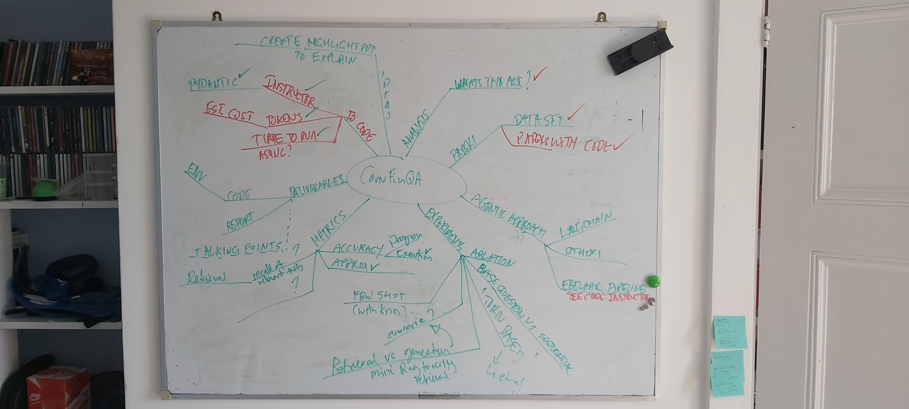
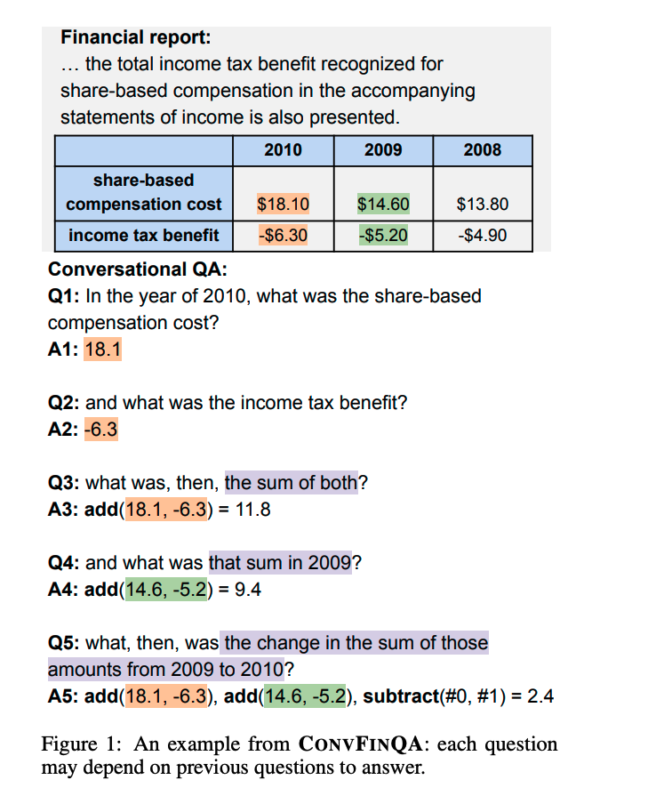
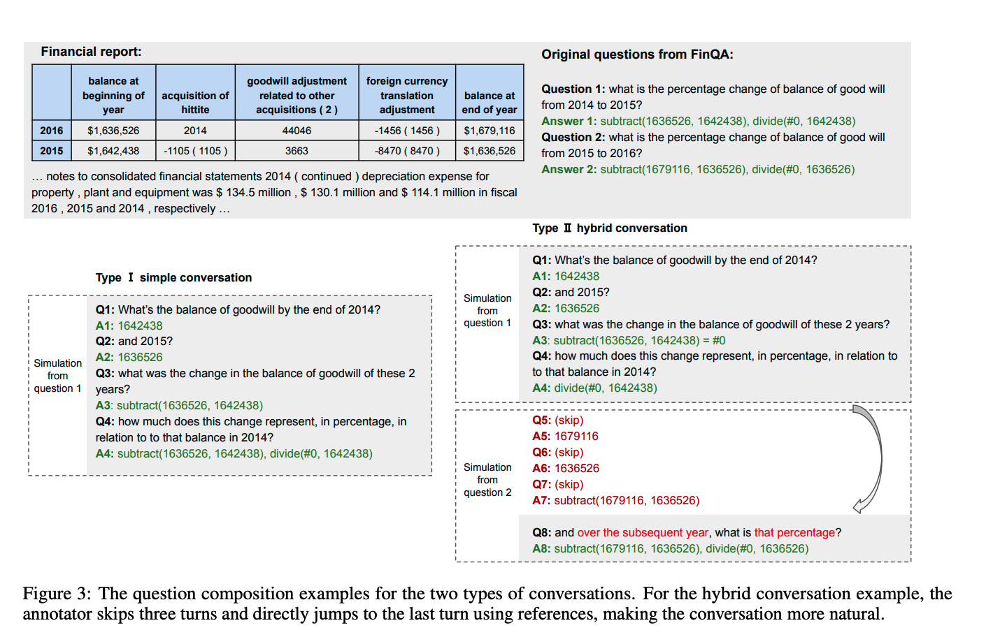

# ConvFinQA
__Numerical Reasoning with the ConvFinQA Dataset__

Aim: explore and evaluate different LLM methods and models on a numerical reasoning dataset

____

CONVFINQA: Exploring the Chain of Numerical Reasoning in Conversational Finance Question Answering

Exploration of answering questions based on financial documents in the ConvFinQA dataset using multi-hop reasoning

**ConvFinQA EMNLP 2022 paper: Exploring the Chain of Numerical Reasoning in Conversational Finance Question Answering** <https://arxiv.org/abs/2210.03849>

### ConvFinQA Dataset
The aim of this dateset is to study the real-world scenario of conversational question answering overfinancial reports:  
*  investors or analysts would typically ask sequential questions to get insights into the numerical in the reports. 
*  The questions require extensive calculations and meanwhile often demonstrate cross dependency, forming the chains of numerical reasoning throughout the conversation.

The dataset consists of short extracts, tables etc from a financial report with a list of analysts question and corresponding answers. The questions focus on extracting specific facts, amounts etc and then proceeding to create specific calculations, summary stats or comparisons.

### Simple and Hybrid Questions
The dataset contains 2 types of conversations:

1.  __Simple Conversation__  
A simple conversation involves the flow of a set of human like questions, each one specifying an additional or refinement of a calculation. Each step is stated.  

2. __Hybrid Conversation__ 
A hybrid question involves a more natural way of conversing where once a method or calculation has been established in context, a human might ask for an equivalent or additional calculation to be performed, in which case we wouldn't expect to explicitly repeat all the intermediate steps, since these are already implicit in the conversation context and history

###

